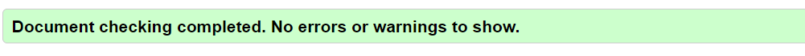
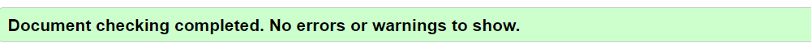
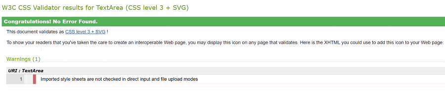
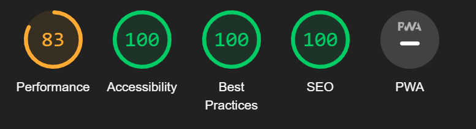
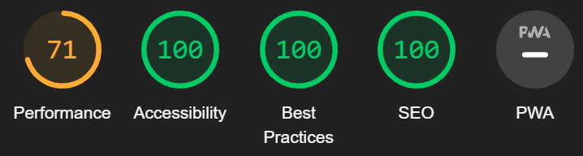
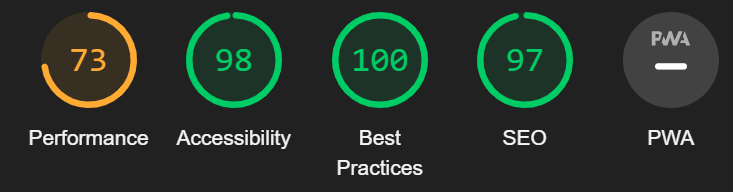

<h1 align="center">Stray Animal Rescue Website</h1

[View the live project here](https://aksurcos.github.io/stray-animals-rescue//)

This site represents a volunteer group that has come together to provide a better life for animals living on the streets, together with the services they provide. 

## Index – Table of Contents
* [User Experience (UX)](#user-experience-ux) 
 
 ## User Experience (UX)

-   ### User stories

    -   #### A. First Time Visitor

        As a first time visitor, I would like to learn who they are and what their services are.

    -   #### B. Returning Visitor

        As a returning visitor, I would like to see their gallery and get a connection with them easily.

    -   #### C. Frequent User
         As a frequent user, I would like join this team easily.

## Features

### Existing Features

-   __Navigation Bar__

    - Navigation bar has simple heading of site, it also inclues Home page, Gallery and Join Us links. It is responsive on different sizes screens. On small screens (such as Galaxy Fold), it will become an icon to drop-down.

Navigation bar's looking except small screens

Closed and dropped down looking of navigation bar for Galaxy Fold

-   __Cards Section__

    - Cards describes community and services. For large screens, it has 1.04 times bigger scaling features.

Cards looking for Galaxy Fold

-   __Join Us Section__

    - This section has sort of application to join and feedback features. It is easy to choose which part users would like join and give feedback.

-   __Footer__

    - Footer has social media accounts link and also has donation link. It is responsive for all screen sizes. It makes easy for users to get contacted with volunteers and donation.

## Design

-   ### Images
    -   The images has sort of harmony with backgrounds and texts thanks to their basic soft colors. 

-   ### Color Set
    -  Color palette is chosen as heart-warming colors. 

       
-   ### Font-Type
    -   Josefin Sans is imported from Google Fonts. It has gentle modern looking.

### Used Languages 

-   HTML5
-   CSS3

## Testing

### Validator Testing and Lighthose

- [HTML Validator](https://validator.w3.org/)

    - result for index.html
      
    - result for gallery.html
      
    - result for signup.html
      

- [CSS Validator](https://jigsaw.w3.org/css-validator/)

    - result for style.css 
      
    The warning is because of import from Google Fonts.

- Lighthouse

- result for index.html
      
    - result for gallery.html
      
    - result for signup.html
      

    

    

     
       
     